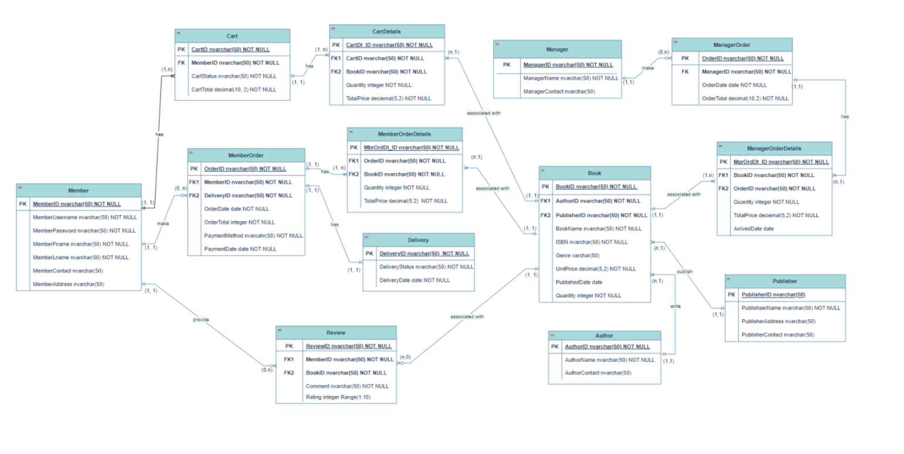

# Online Bookstore - SQL Database Solution
**Introduction**  

This project is a comprehensive database solution developed for an online bookstore. It efficiently manages various data-processing tasks such as book inventory, customer orders, and sales tracking. Built using Microsoft SQL Server, the database ensures the smooth functioning of essential operations required for the online bookstore.


**Features and Functionality**

+ Inventory Management: Tracks and manages book details like title, author, genre, price, and stock levels.
+ Order Processing: Manages customer orders, including order details, order fulfillment, and delivery tracking.
+ Customer Management: Handles customer data such as registration, personal information, and order history.
+ Sales Reporting: Provides insights into revenue and best-selling books through easy tracking of sales data.


**Tools Used**
+ SQL: For data manipulation and query execution.
+ Microsoft SQL Server: Relational Database Management System for storing and managing the bookstore’s data.


**ERD Diagram**




**Database Structure Overview**

+ Books: Stores information about the books, including title, author, genre, price, and available stock.
+ Members: Contains data for the bookstore's customers, such as username, contact details, and shipping address.
+ Orders: Manages customer orders, including order date, total price, and delivery information.
+ OrderDetails: Provides detailed information about each order, including the books ordered and quantities.
+ Cart: Manages the items in a customer’s cart before checkout.
+ Reviews: Stores book reviews provided by customers, including ratings and comments.
+ Publishers: Stores data about the book publishers.


**Getting Started**
+ To set up the online bookstore database locally, follow these steps:

1. Install SQL Server: Ensure that Microsoft SQL Server is installed on your local machine.
2. Clone the Repository: Clone the repository to your local machine using:
```
git clone https://github.com/ShriraamNagarajan/BookstoreDatabase.git
```
3. Import SQL Scripts: Run the provided SQL scripts to set up the database schema and populate the tables with initial data:
```
sqlcmd -S servername -i database_seeding.sql
```


**Technologies Used**

+ SQL: For querying and managing the database.
+ Microsoft SQL Server: The chosen RDBMS for its reliability and performance in handling large datasets.
+ Draw.io: To design the database schema


**Future Enhancements**

+ Recommendation System: In the future, a recommendation system could be added to suggest books based on customer preferences and previous orders.
+ Enhanced Reporting: Adding more advanced reporting features to provide deeper insights into customer behavior and sales trends.


**Contact Information**

+ For any questions, suggestions, or feedback, please feel free to reach out:

    + Email: shrirajan331@gmail.com
    + LinkedIn: https://www.linkedin.com/in/shriraam-nagarajan-827b38198/


Thank you for checking out this project!😊
